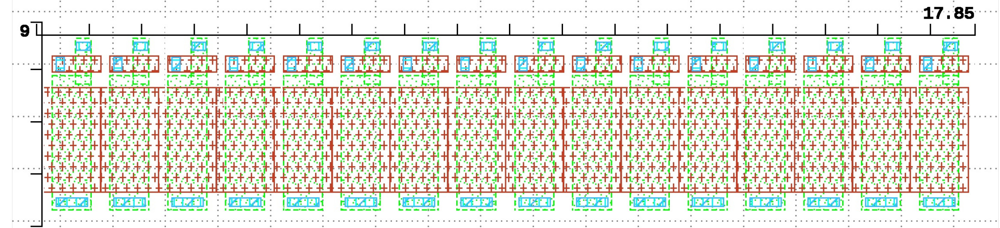
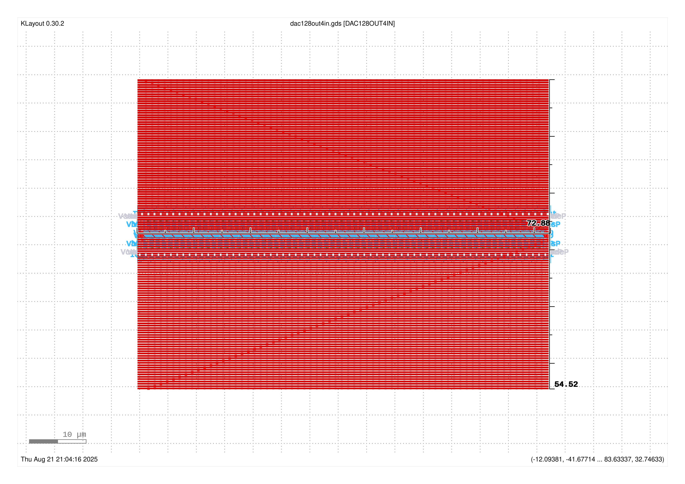
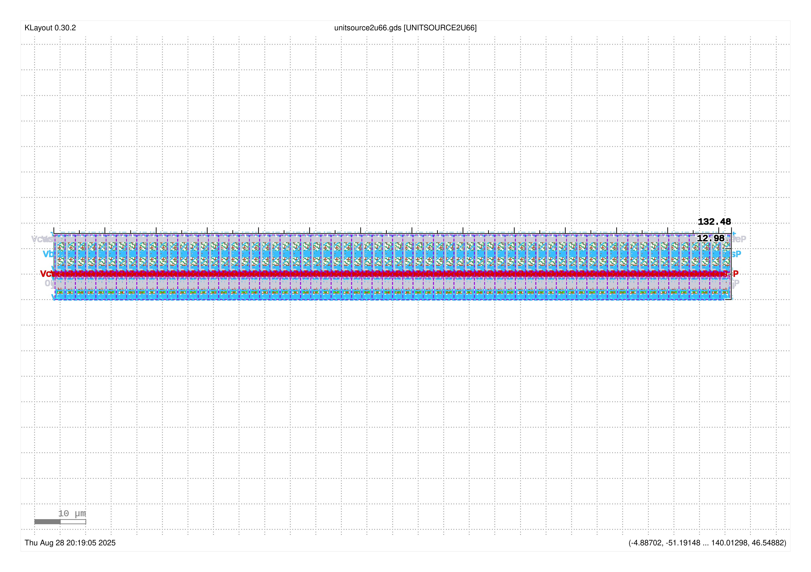
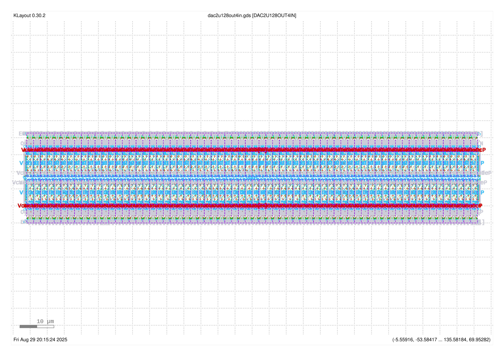

# Analog Design Flow  

[This design](./README.md) is a mixed-signal design.  
The digital design flow isn't really applicable.  
  
It is rather counterproductive to do a top down design.  
The proof is in the analog layout pudding, 
and accurate extraction and modeling of the key analog elements.  

## In progress  

* Lay out switched cascode transistor  
    * pmos transistor with  
        * gate contact  
        * drain contact  
        * source connected to current source transistor by pdiffusion abutment  
    * arrangeable in an array by abutment  
        * the width of the cascode transistor, plus the gate contact and poly spacing, 
          determine the width of a unit current source  
    * define as [DRC clean parametrizable cell](https://github.com/tatzelbrumm/klayoutAPI/blob/master/switched_pmos_cascode.py)  
        * cascode length  
        * cascode width  
* Extend cascode transistor to switched cascoded current source  
    * for good matching and low 1/f noise, long and narrow  
    * arrangeable in an array by abutment  
    * shared poly for common bias voltage    
* Mockup [layout of a row of 256 unit current sources](https://github.com/tatzelbrumm/PUDDING/blob/tatzelbranch/gds/pcascsrc256.gds).  
It doesn't make sense to lay out a 256 element thermometer code DAC as one row,  
but this layout (column width: 282&mu;m, height: 4.4&mu;m)  
shows that the analog part of the design will fit within a HeiChips tile comfortably.  

### [Proof-of-concept unit cell](https://github.com/tatzelbrumm/PUDDING/blob/tatzelbranch/gds/swcascsrc_playground.gds)  

width: 1.1&mu;m, height 3.9&mu;m  

#### Layout
    

* [DRC and LvS clean row of 16 unit current sources](https://github.com/jobueh/PUDDING/blob/tatzelbranch/gds/swsources16.gds)  
* [Test schematic with 2 unit sources as reference current mirror, 16 output sources](https://github.com/jobueh/PUDDING/blob/tatzelbranch/xschem/test_pcascsrc16_DC.sch)  

  

* [DRC clean 2x64 unit current sources analog-only layout](https://github.com/jobueh/PUDDING/blob/tatzelbranch/gds/dac128out4in.gds)
  
  
  
* [DRC clean 2x64 unit current sources analog-only layout](https://github.com/jobueh/PUDDING/blob/tatzelbranch/gds/dac128out4in.gds)
  
  

* **Design cascode bias generator**  
    * **Create test schematics to characterize gm/Id and gm/go of transistors**  
    * **Create test schematics to characterize go of cascoded current sources as function of voltage**  
* Extend cascode transistor to switched cascoded current source  
    * define as DRC clean parametrizable cell  
        * current source length  
        * current source width  
        * cascode length  
        * cascode width  
* Extract [post-layout netlist for LvS](https://github.com/jobueh/PUDDING/blob/tatzelbranch/gds/PCASCSRC16_extracted.cir)  
  to compare against [xschem schematic](https://github.com/jobueh/PUDDING/blob/tatzelbranch/xschem/simulation/pcascsrc16.spice)  

### Gotchas

* Hierarchical bottom up analog design leads to crashes unless a verified best practice how to reference to [hierarchical klayout libraries](https://github.com/tatzelbrumm/klayoutAPI/tree/master) is established and verified    
    **Problem:** This requires coordination by different domain experts, namely  
    * klayout  
    * IHP analog PDK  
    * IHP analog standard cell library organization  
    * any containers or other virtualization schemes that might be used  
    In discussion forums, you get `#worksforme` answers from experts in *one* of the domains
    that don't take into account side effects.    
    Such answers are **less** than useless.  
    **One** *czar of pcells* needs to be volunteered to establish, publish, and maintain    
    **RECOMMENDED BEST PRACTICES** about directory structures, instantiation hierarchies, how to include sub-layout cells (parametric or not) into klayout GDS files.  
    **Solution for now:** Import sub-`.gds` schematic files into the top level schematic.  
    * Invariant under various and sundry (and subtly incompatible) library integration schemes:    
      The top level `.gds` file is self-contained.
* When thinking how to connect digital outputs to the cascode switches,  
    * the transistors that switch between VDDA and Vcasc,P should be directly adjacent to the switched sources  
    * the pinout and form factor of the digital logic driving a row of 64 current sources needs to have matching form factor and pinout.
* Connecting Vbias,p by poly abutment is *not* just a bad idea because at cryogenic temperatures, poly may become highly resistive. *(Solved)*  
    It is also advantageous to shield the current sources by `metal1`  
    * so the connections to the switch/cascode transistors can be routed on top of the current sources without adverse effects on matching.  
    * `metal1` density rules are met without random `metal1` fill on the most mismatch sensitive analog transistors.  

#### The current mirror design isn't as robust to size variations as expected  

I need to get an overview which simulation environment and device dimensions work and which don't.  

* [test_pcsource_DC.sch](https://github.com/jobueh/PUDDING/blob/tatzelbranch/xschem/test_pcsource_DC.sch)    
    * Original dimensions:  
        * source 0.55&mu;m/2&mu;m  
        * cascode 0.3&mu;m/0.3&mu;m  
        * bias transistor 6&mu;m/0.15&mu;m  
    look sane at `tt` corner, 27&deg;C.  
* [test_pcascsrc_DC.sch](https://github.com/jobueh/PUDDING/blob/tatzelbranch/xschem/test_pcascsrc_DC.sch)    
    with adjustable parameters  
    * Dimensions as drawn in [pcsource2u.gds](https://github.com/jobueh/PUDDING/blob/tatzelbranch/gds/pcsource2u.gds):  
        * source 1.45&mu;m/5&mu;m  
        * cascode 1.2&mu;m/0.6&mu;m  
        * bias transistor 3&mu;m/0.15&mu;m, 6&mu;m/0.15&mu;m 12&mu;m/0.15&mu;m  
    look sane at `tt`, `ss`, `ff` corners at -55&deg;C, 27&deg;C, 150&deg;C.  
    ***Gate leakage*** becomes a factor, especially at `ff` corner for large output voltage drops and Iref=10nA.  
* [test_pcascsrc_mult_DC.sch](https://github.com/jobueh/PUDDING/blob/tatzelbranch/xschem/test_pcascsrc_mult_DC.sch)    
    with adjustable parameters and number of input and output currents  
    * Dimensions as drawn in [pcsource2u.gds](https://github.com/jobueh/PUDDING/blob/tatzelbranch/gds/pcsource2u.gds):  
        * source 1.45&mu;m/5&mu;m  
        * cascode 1.2&mu;m/0.6&mu;m  
        * bias transistor 6&mu;m/0.15&mu;m  
        works for  
            *  32 out, 2 in  
            *  64 out, 2 in  
            * 128 out, 4 in  
        DC OP convergence problems for  
            * 256 out, 8 in  
* [test_switchedsources_tran.sch](https://github.com/jobueh/PUDDING/blob/tatzelbranch/xschem/test_switchedsources_tran.sch)    
    with adjustable parameters and number of input and output currents  
    * Dimensions as drawn in [pcsource2u.gds](https://github.com/jobueh/PUDDING/blob/tatzelbranch/gds/pcsource2u.gds):  
        * source 1.45&mu;m/5&mu;m  
        * cascode 1.2&mu;m/0.6&mu;m  
        * bias transistor 6&mu;m/0.15&mu;m    
        works when not using *leaky* `lvpmos` as bypass capacitors for the bias lines  
* [test_unitsource2u_DC.sch](https://github.com/jobueh/PUDDING/blob/tatzelbranch/xschem/test_unitsource2u_DC.sch)    
    with adjustable number of input and output currents  
    * Dimensions as drawn in [pcsource2u.gds](https://github.com/jobueh/PUDDING/blob/tatzelbranch/gds/pcsource2u.gds):  
        * source 1.45&mu;m/5&mu;m  
        * cascode 1.2&mu;m/0.6&mu;m  
        * bias transistor 6&mu;m/0.15&mu;m    
        works when not using *leaky* `lvpmos` as bypass capacitors for the bias lines  
        works for  
            *  1 out, 1 in  
            *  64 out, 2 in  
                With 66 current sources, gate leakage becomes a factor.  
* [test_unitsource2u_DC.tran](https://github.com/jobueh/PUDDING/blob/tatzelbranch/xschem/test_unitsource2u_tran.sch)    
    with adjustable number of input and output currents  
    * Dimensions as drawn in [pcsource2u.gds](https://github.com/jobueh/PUDDING/blob/tatzelbranch/gds/pcsource2u.gds):  
        * source 1.45&mu;m/5&mu;m  
        * cascode 1.2&mu;m/0.6&mu;m  
        * bias transistor 6&mu;m/0.15&mu;m  
        works for  
            * 1 out, 1 in  
                 HVPMOS bypass varactors really make a difference
            * 64 out, 2 in  
                 The simulation takes forever  

## To do  

* Extract post-layout netlist with parasitics  
* Use suitable device models  
    * that can handle millikelvin temperatures  
    * Make the models available in the open environment  
    * If the models don't exist, write them  

* Find out how to generate analog/mixed signal pad frames  
    * Preferably without involving the librelane overhead  
        * Look at Krzysztof Herman's repositories and examples  
    * Suitable for stand-alone submission of designs 
        * in the last free IHP BiCMOS run  
        * in the last free IHP CMOS engineering run  
        * Find valid reasons to submit designs on later IHP characterization runs  

* Design input current sinks for unit current generation  
    * External input pad  
    * on-chip current reference (if sufficient time and support)  

## References  

[IHP Open PDK](https://github.com/IHP-GmbH/IHP-Open-PDK/)  
[IHP Open PDK docs](https://github.com/IHP-GmbH/IHP-Open-PDK-docs/)  
